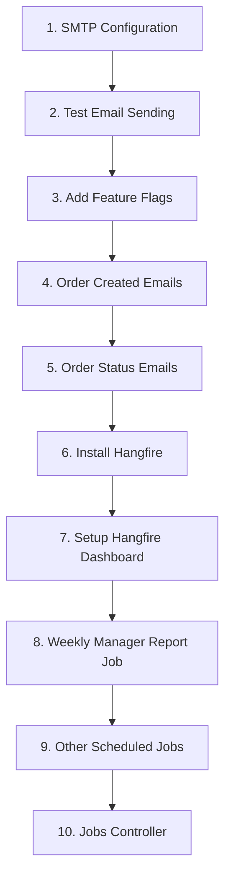

# Email & Scheduler Implementation Plan

## Table of Contents
1. [Current State Analysis](#1-current-state-analysis)
2. [SMTP Configuration Guide](#2-smtp-configuration-guide)
3. [Email Types & Templates](#3-email-types--templates)
4. [Feature Flags for Email](#4-feature-flags-for-email)
5. [Scheduler Architecture (Hangfire)](#5-scheduler-architecture-hangfire)
6. [Implementation Tasks](#6-implementation-tasks)
7. [API Endpoints](#7-api-endpoints)

---

## 1. Current State Analysis

### ✅ What Exists
| Component | Status | Location |
|-----------|--------|----------|
| `IEmailService` interface | ✅ Complete | `Application/Interfaces/IEmailService.cs` |
| `EmailService` implementation | ✅ Complete | `Infrastructure/Services/EmailService.cs` |
| `EmailLog` entity | ✅ Complete | `Domain/Entities/EmailLog.cs` |
| `SmtpSettings` configuration | ✅ Partial | `appsettings.json` - needs credentials |
| `EmailController` | ✅ Exists | `Api/Controllers/EmailController.cs` |
| Email templates (inline) | ✅ Basic | 7 templates in EmailService |

### ❌ What's Missing
| Component | Priority | Description |
|-----------|----------|-------------|
| SMTP credentials | **Critical** | Username/password not configured |
| Background job scheduler | **High** | Need Hangfire for recurring jobs |
| Order notification emails | **High** | Send emails on order creation/status change |
| Weekly manager reports | **Medium** | Excel report every Monday 7:30 AM |
| Feature flags for emails | **Medium** | Control which emails are sent |
| Email attachments support | **Medium** | PDF order documents |
| Cleanup jobs | **Low** | Old email logs, expired tokens |

---

## 2. SMTP Configuration Guide

### Option A: Gmail SMTP (Development/Testing)

> ⚠️ **Note**: Gmail requires "App Passwords" if 2FA is enabled.

**Steps:**
1. Go to [Google Account Security](https://myaccount.google.com/security)
2. Enable 2-Step Verification
3. Go to **App passwords** → Generate new app password
4. Use the 16-character password in configuration

```json
// appsettings.Development.json
{
  "SmtpSettings": {
    "Enabled": true,
    "Host": "smtp.gmail.com",
    "Port": 587,
    "EnableSsl": true,
    "Username": "your-email@gmail.com",
    "Password": "xxxx-xxxx-xxxx-xxxx",  // App password (16 chars)
    "FromEmail": "noreply@pharmaassist.ba",
    "FromName": "PharmaAssist"
  }
}
```

### Option B: Microsoft 365 / Outlook SMTP

```json
{
  "SmtpSettings": {
    "Enabled": true,
    "Host": "smtp.office365.com",
    "Port": 587,
    "EnableSsl": true,
    "Username": "your-email@yourdomain.com",
    "Password": "your-password",
    "FromEmail": "orders@pharmaassist.ba",
    "FromName": "PharmaAssist"
  }
}
```

### Option C: SendGrid (Recommended for Production)

**Steps:**
1. Create account at [SendGrid](https://sendgrid.com)
2. Go to **Settings** → **API Keys** → Create API Key
3. Verify sender identity under **Sender Authentication**

```json
{
  "SmtpSettings": {
    "Enabled": true,
    "Host": "smtp.sendgrid.net",
    "Port": 587,
    "EnableSsl": true,
    "Username": "apikey",
    "Password": "SG.xxxxxxxxxxxxxxxxxxxxxxxxxxxxxxxxxx",
    "FromEmail": "orders@pharmaassist.ba",
    "FromName": "PharmaAssist"
  }
}
```

### Option D: Amazon SES

```json
{
  "SmtpSettings": {
    "Enabled": true,
    "Host": "email-smtp.eu-central-1.amazonaws.com",
    "Port": 587,
    "EnableSsl": true,
    "Username": "AKIA...",
    "Password": "...",
    "FromEmail": "orders@pharmaassist.ba",
    "FromName": "PharmaAssist"
  }
}
```

### Option E: Local SMTP (Development Only)

Use **Papercut SMTP** or **MailHog** for local testing without real emails:

```bash
# Install MailHog
docker run -d -p 1025:1025 -p 8025:8025 mailhog/mailhog
```

```json
{
  "SmtpSettings": {
    "Enabled": true,
    "Host": "localhost",
    "Port": 1025,
    "EnableSsl": false,
    "Username": "",
    "Password": "",
    "FromEmail": "noreply@pharmaassist.local",
    "FromName": "PharmaAssist (Dev)"
  }
}
```

Open `http://localhost:8025` to view sent emails.

---

## 3. Email Types & Templates

### 3.1 Existing Email Types

| Type | Enum Value | Template | Status |
|------|------------|----------|--------|
| Welcome | 1 | ✅ | Exists |
| Password Reset | 2 | ✅ | Exists |
| Order Confirmation | 4 | ✅ | Exists |
| Order Shipped | 5 | ✅ | Exists |
| Low Stock Alert | 9 | ✅ | Exists |
| Expiry Alert | 10 | ✅ | Exists |
| Order Received (Internal) | 14 | ✅ | Exists |

### 3.2 New Email Types to Add

| Type | Enum Value | Description | Triggered By |
|------|------------|-------------|--------------|
| Order Status Update | 15 | Notify customer of status change | Order status change |
| Order Delivered | 6 | Confirm delivery to customer | Status → Delivered |
| Weekly Manager Report | 16 | Excel with rep visit data | Scheduler (Mon 7:30) |
| Monthly Summary | 17 | Monthly sales/activity summary | Scheduler (1st of month) |
| Visit Reminder | 18 | Remind rep of scheduled visits | Scheduler (daily 7:00) |
| Payment Reminder | 19 | Overdue payment notice | Scheduler (weekly) |
| New Customer Assigned | 20 | Rep notified of new customer | Customer assignment |
| Target Achievement | 21 | Congratulate on target met | Target achieved |

### 3.3 Email Templates to Create

#### Order Created Email (to Customer)
```html
Subject: Order Confirmation - {{OrderNumber}} | PharmaAssist

Dear {{CustomerName}},

Thank you for your order! Here are the details:

Order Number: {{OrderNumber}}
Order Date: {{OrderDate}}
Items: {{ItemCount}} products
Total: {{OrderTotal}} BAM

{{#OrderItems}}
• {{ProductName}} x {{Quantity}} = {{LineTotal}} BAM
{{/OrderItems}}

Expected Delivery: {{ExpectedDelivery}}

Track your order: {{TrackingLink}}

Best regards,
The PharmaAssist Team
```

#### Order Created Email (to Company - orders@pharmaassist.com)
```html
Subject: [NEW ORDER] {{OrderNumber}} - {{CustomerName}} ({{Region}})

New Order Received

Customer: {{CustomerName}}
Sales Rep: {{SalesRepName}}
Region: {{Region}}

Order Details:
- Order #: {{OrderNumber}}
- Total: {{OrderTotal}} BAM
- Items: {{ItemCount}}
- Priority: {{Priority}}

{{#HasNotes}}
Notes: {{OrderNotes}}
{{/HasNotes}}

View in Dashboard: {{OrderLink}}
```

#### Order Status Update Email
```html
Subject: Order Update - {{OrderNumber}} is now {{StatusName}}

Dear {{CustomerName}},

Your order {{OrderNumber}} has been updated:

Previous Status: {{PreviousStatus}}
New Status: {{NewStatus}}
Updated: {{UpdatedAt}}

{{#IsShipped}}
Tracking Number: {{TrackingNumber}}
Carrier: {{Carrier}}
{{/IsShipped}}

{{#IsDelivered}}
Thank you for your business! We hope you're satisfied with your order.
Please contact us if you have any questions.
{{/IsDelivered}}

Track your order: {{TrackingLink}}
```

#### Weekly Manager Report Email
```html
Subject: Weekly Visit Report - {{RegionName}} ({{WeekRange}})

Dear {{ManagerName}},

Please find attached the weekly visit report for your team.

Summary for {{WeekRange}}:
- Total Visits: {{TotalVisits}}
- Visits Completed: {{CompletedVisits}} ({{CompletionRate}}%)
- Orders Placed: {{OrdersPlaced}}
- Total Revenue: {{TotalRevenue}} BAM

Top Performer: {{TopRepName}} ({{TopRepVisits}} visits)
Needs Attention: {{LowPerformerName}} ({{LowPerformerVisits}} visits)

See attached Excel file for full details.

Best regards,
PharmaAssist Reporting System
```

---

## 4. Feature Flags for Email

### 4.1 New Feature Flags

| Flag Key | Category | Type | Default | Description |
|----------|----------|------|---------|-------------|
| `email.orderConfirmation` | Orders | Boolean | true | Send order confirmation to customer |
| `email.orderStatusUpdates` | Orders | Boolean | true | Send status update emails |
| `email.orderShipped` | Orders | Boolean | true | Send shipped notification |
| `email.orderDelivered` | Orders | Boolean | true | Send delivery confirmation |
| `email.internalOrderNotification` | Orders | Boolean | true | Send new orders to orders@company.com |
| `email.weeklyManagerReports` | Reports | Boolean | true | Send weekly visit reports to managers |
| `email.dailyVisitReminders` | Reports | Boolean | false | Send daily visit schedule reminders |
| `email.lowStockAlerts` | Inventory | Boolean | true | Send low stock notifications |
| `email.expiryAlerts` | Inventory | Boolean | true | Send expiry notifications |
| `email.globalEnabled` | System | Boolean | true | Master switch for all emails |

### 4.2 SQL Seed Script for Email Feature Flags

```sql
-- Email Feature Flags
INSERT INTO SystemFeatureFlags ([Key], Name, Description, Category, Type, Value, DefaultValue, IsEnabled, AllowClientOverride, Environment, IsDeleted, CreatedAt, CreatedBy)
VALUES 
('email.globalEnabled', 'Email Global Switch', 'Master switch to enable/disable all email sending', 0, 0, 'true', 'true', 1, 0, NULL, 0, GETUTCDATE(), 'Seed'),
('email.orderConfirmation', 'Order Confirmation Email', 'Send order confirmation to customers', 4, 0, 'true', 'true', 1, 1, NULL, 0, GETUTCDATE(), 'Seed'),
('email.orderStatusUpdates', 'Order Status Updates', 'Send email when order status changes', 4, 0, 'true', 'true', 1, 1, NULL, 0, GETUTCDATE(), 'Seed'),
('email.orderShipped', 'Order Shipped Email', 'Send notification when order is shipped', 4, 0, 'true', 'true', 1, 1, NULL, 0, GETUTCDATE(), 'Seed'),
('email.orderDelivered', 'Order Delivered Email', 'Send confirmation when order is delivered', 4, 0, 'true', 'true', 1, 1, NULL, 0, GETUTCDATE(), 'Seed'),
('email.internalOrderNotification', 'Internal Order Notification', 'Send new orders to orders@pharmaassist.com', 4, 0, 'true', 'true', 1, 0, NULL, 0, GETUTCDATE(), 'Seed'),
('email.weeklyManagerReports', 'Weekly Manager Reports', 'Send weekly visit reports to managers', 5, 0, 'true', 'true', 1, 0, NULL, 0, GETUTCDATE(), 'Seed'),
('email.dailyVisitReminders', 'Daily Visit Reminders', 'Send daily visit schedule to reps', 5, 0, 'false', 'false', 0, 0, NULL, 0, GETUTCDATE(), 'Seed'),
('email.lowStockAlerts', 'Low Stock Alerts', 'Send low stock notifications to inventory team', 3, 0, 'true', 'true', 1, 0, NULL, 0, GETUTCDATE(), 'Seed'),
('email.expiryAlerts', 'Expiry Alerts', 'Send product expiry notifications', 3, 0, 'true', 'true', 1, 0, NULL, 0, GETUTCDATE(), 'Seed');
```

---

## 5. Scheduler Architecture (Hangfire)

### 5.1 Why Hangfire?

| Feature | Hangfire | Quartz.NET | Timer-based |
|---------|----------|------------|-------------|
| Dashboard UI | ✅ Built-in | ❌ Separate | ❌ None |
| Persistence | ✅ SQL Server | ✅ SQL Server | ❌ Memory |
| Retry logic | ✅ Automatic | Manual | Manual |
| CRON support | ✅ Yes | ✅ Yes | ❌ No |
| .NET Core support | ✅ Excellent | ✅ Good | ✅ Native |
| Learning curve | Low | Medium | Low |

### 5.2 Hangfire Setup

#### Install NuGet Packages

```bash
cd server/src/Api
dotnet add package Hangfire.Core
dotnet add package Hangfire.SqlServer
dotnet add package Hangfire.AspNetCore
```

#### Configure in Program.cs

```csharp
// Add Hangfire services
builder.Services.AddHangfire(config => config
    .SetDataCompatibilityLevel(CompatibilityLevel.Version_180)
    .UseSimpleAssemblyNameTypeSerializer()
    .UseRecommendedSerializerSettings()
    .UseSqlServerStorage(builder.Configuration.GetConnectionString("DefaultConnection"), 
        new SqlServerStorageOptions
        {
            CommandBatchMaxTimeout = TimeSpan.FromMinutes(5),
            SlidingInvisibilityTimeout = TimeSpan.FromMinutes(5),
            QueuePollInterval = TimeSpan.Zero,
            UseRecommendedIsolationLevel = true,
            DisableGlobalLocks = true,
            PrepareSchemaIfNecessary = true,
            SchemaName = "Hangfire"
        }));

builder.Services.AddHangfireServer();

// ... after app.Build()

// Configure Hangfire dashboard (admin only)
app.MapHangfireDashboard("/hangfire", new DashboardOptions
{
    Authorization = new[] { new HangfireAuthorizationFilter() }
});

// Register recurring jobs
RecurringJobs.RegisterAll(app.Services);
```

### 5.3 Job Types

| Job Name | Schedule | Description |
|----------|----------|-------------|
| `WeeklyManagerReportJob` | Monday 7:30 AM | Send visit reports to managers by region |
| `DailyVisitReminderJob` | Daily 7:00 AM | Send today's visit schedule to reps |
| `RetryFailedEmailsJob` | Every 15 min | Retry failed email sends (max 3 attempts) |
| `CleanupOldEmailLogsJob` | Daily 2:00 AM | Archive/delete email logs > 90 days |
| `CleanupExpiredTokensJob` | Daily 3:00 AM | Remove expired refresh tokens |
| `LowStockAlertJob` | Daily 8:00 AM | Check and alert on low stock items |
| `ExpiryAlertJob` | Weekly (Mon) | Check products expiring in 30 days |
| `MonthlyReportJob` | 1st of month | Generate monthly summary reports |

### 5.4 Job Architecture

```
Application/
├── Interfaces/
│   ├── IJobService.cs           # Base job interface
│   └── IScheduledJobService.cs  # Job registration
├── Jobs/
│   ├── EmailJobs/
│   │   ├── WeeklyManagerReportJob.cs
│   │   ├── DailyVisitReminderJob.cs
│   │   └── RetryFailedEmailsJob.cs
│   ├── CleanupJobs/
│   │   ├── EmailLogCleanupJob.cs
│   │   └── TokenCleanupJob.cs
│   └── AlertJobs/
│       ├── LowStockAlertJob.cs
│       └── ExpiryAlertJob.cs

Infrastructure/
├── Services/
│   └── ScheduledJobService.cs   # Job registration

Api/
├── Controllers/
│   └── JobsController.cs        # Manual job triggers
├── Hangfire/
│   ├── HangfireAuthorizationFilter.cs
│   └── RecurringJobs.cs         # Job schedule configuration
```

---

## 6. Implementation Tasks

### Phase 1: Core Email Infrastructure (Priority: High)

- [ ] **6.1.1** Configure SMTP credentials in appsettings
- [x] **6.1.2** Add email attachment support to `EmailService`
- [x] **6.1.3** Add new email types to `EmailType` enum
- [x] **6.1.4** Create new email templates
- [x] **6.1.5** Add email feature flags to database

### Phase 2: Order Email Integration (Priority: High)

- [x] **6.2.1** Create `IOrderEmailService` interface
- [x] **6.2.2** Implement `OrderEmailService` with methods:
  - `SendOrderCreatedToCustomerAsync(Order order)`
  - `SendOrderCreatedToCompanyAsync(Order order)`
  - `SendOrderStatusUpdateAsync(Order order, OrderStatus previousStatus)`
  - `SendOrderShippedAsync(Order order)`
  - `SendOrderDeliveredAsync(Order order)`
- [ ] **6.2.3** Integrate email sending in `OrderService.CreateAsync`
- [ ] **6.2.4** Integrate email sending in order status update flow
- [ ] **6.2.5** Add PDF order document generation and attachment

### Phase 3: Hangfire Scheduler Setup (Priority: High)

- [x] **6.3.1** Install Hangfire NuGet packages
- [x] **6.3.2** Configure Hangfire in `Program.cs`
- [x] **6.3.3** Create `HangfireAuthorizationFilter` (Admin only)
- [x] **6.3.4** Create job base classes and interfaces
- [x] **6.3.5** Run Hangfire migrations (automatic)

### Phase 4: Scheduled Jobs (Priority: Medium)

- [x] **6.4.1** Implement `WeeklyManagerReportJob`:
  - Query visits from last week by region
  - Generate Excel file with visit details
  - Send email with attachment to managers
- [x] **6.4.2** Implement `RetryFailedEmailsJob`
- [x] **6.4.3** Implement `CleanupOldEmailLogsJob`
- [ ] **6.4.4** Implement `LowStockAlertJob`
- [x] **6.4.5** Create `JobsController` for manual triggers

### Phase 5: Weekly Manager Report Details (Priority: Medium)

- [x] **6.5.1** Create `IEmailSchedulingManager` interface
- [x] **6.5.2** Implement CSV generation (Excel with EPPlus/ClosedXML is TODO)
- [x] **6.5.3** Group report data by manager (region support is TODO)
- [x] **6.5.4** Include visit details: date, customer, rep, duration, outcome, notes
- [x] **6.5.5** Schedule for Monday 7:30 AM in Central European timezone

---

## 7. API Endpoints

### 7.1 Jobs Controller

```
POST   /api/jobs/weekly-manager-report      # Trigger weekly report manually
POST   /api/jobs/retry-failed-emails        # Retry failed emails now
POST   /api/jobs/cleanup-email-logs         # Run cleanup job
GET    /api/jobs/status                     # Get job execution status
GET    /api/jobs/history                    # Get recent job runs
DELETE /api/jobs/{jobId}                    # Cancel a scheduled job
```

### 7.2 Enhanced Email Controller

```
GET    /api/emails                          # Get email logs (paginated)
GET    /api/emails/{id}                     # Get email details
GET    /api/emails/statistics               # Get email stats
POST   /api/emails/retry/{id}               # Retry single failed email
POST   /api/emails/retry-all                # Retry all failed emails
POST   /api/emails/test                     # Send test email
DELETE /api/emails/{id}                     # Delete email log
```

---

## 8. Configuration Reference

### Complete appsettings.json Section

```json
{
  "SmtpSettings": {
    "Enabled": true,
    "Host": "smtp.sendgrid.net",
    "Port": 587,
    "EnableSsl": true,
    "Username": "apikey",
    "Password": "YOUR_SENDGRID_API_KEY",
    "FromEmail": "noreply@pharmaassist.ba",
    "FromName": "PharmaAssist"
  },
  "EmailSettings": {
    "CompanyOrdersEmail": "orders@pharmaassist.com",
    "SupportEmail": "support@pharmaassist.ba",
    "MaxRetries": 3,
    "RetryDelayMinutes": 15,
    "LogRetentionDays": 90,
    "BatchSize": 50
  },
  "HangfireSettings": {
    "DashboardPath": "/hangfire",
    "WorkerCount": 5,
    "SchedulePollingInterval": 15
  },
  "ScheduledJobs": {
    "WeeklyManagerReport": {
      "Enabled": true,
      "CronExpression": "30 7 * * 1",
      "Description": "Every Monday at 7:30 AM"
    },
    "RetryFailedEmails": {
      "Enabled": true,
      "CronExpression": "*/15 * * * *",
      "Description": "Every 15 minutes"
    },
    "CleanupEmailLogs": {
      "Enabled": true,
      "CronExpression": "0 2 * * *",
      "Description": "Daily at 2:00 AM"
    },
    "LowStockAlerts": {
      "Enabled": true,
      "CronExpression": "0 8 * * 1-5",
      "Description": "Weekdays at 8:00 AM"
    }
  }
}
```

---

## 9. Implementation Order



### Recommended Implementation Sequence

1. **Day 1**: Configure SMTP, test email sending works
2. **Day 1**: Add email feature flags to database
3. **Day 2**: Implement order created emails (customer + company)
4. **Day 2**: Implement order status update emails
5. **Day 3**: Install and configure Hangfire
6. **Day 3**: Create weekly manager report job
7. **Day 4**: Add Excel generation for weekly reports
8. **Day 4**: Create JobsController for manual triggers
9. **Day 5**: Add remaining scheduled jobs
10. **Day 5**: Testing and refinement

---

## 10. Security Considerations

1. **SMTP Credentials**: Store in Azure Key Vault or environment variables in production
2. **Hangfire Dashboard**: Restrict to Admin/SuperAdmin roles only
3. **Email Content**: Never include passwords or sensitive data in emails
4. **Rate Limiting**: Implement rate limiting on email sending to prevent abuse
5. **Audit Trail**: All email sends are logged in EmailLogs table

---

## Next Steps

Ready to start implementation? The first step is:

1. Choose your SMTP provider (Section 2)
2. Configure credentials in `appsettings.Development.json`
3. Test by calling `POST /api/emails/test` with a valid email address

Then proceed with Phase 1 tasks in Section 6.
